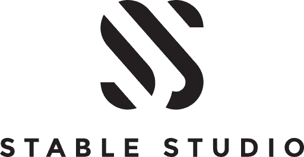

<a id="readme-top"></a>

<div align="center">
  <a href="https://stablestudio.org">
    
  </a>

  <h3 align="center">Stable Studio</h3>

  <p align="center">
    The main repository for Stable Studio.
    <br />
    <a href="https://stablestudio.org">View Page</a>
  </p>
</div>


<details>
  <summary>Table of Contents</summary>
  <ol>
    <li>
      <a href="#about-the-project">About The Project</a>
      <ul>
        <li><a href="#built-with">Built With</a></li>
      </ul>
    </li>
    <li>
      <a href="#develop-locally">Develop locally</a>
    </li>
    <li>
      <a href="#tech-details">Technical Details</a>
    </li>
    <li><a href="#contributing">Contributing</a></li>
    <li><a href="#license">License</a></li>
  </ol>
</details>


## About The Project

Although I have had a lot of experiences with Frontend frameworks and libraries, this is my first time learning GSAP and building a website with it. The journey has been rough. The gsap forum is huge and it is hard to find exactly what you are looking for, code snippets are scattered. Sure you can read the docs but animation is NOT the kind of thing that you can just read through the docs and suddenly be able to build everything. As such, I have started a discord community for the discussions of various animation libraries such as GSAP, framer motion, Anime JS, etc.

https://discord.gg/jZptuPDg

<p align="right">(<a href="#readme-top">back to top</a>)</p>


### Built With

Le tech stack

* Astro v4.15.9
  * i18n
  * sitemap
  * seo tags
  * markup schemas
* GSAP v3.12.5
* Lenis JS v1.1.14-dev.1 (with overscrolling, see [issue](https://github.com/darkroomengineering/lenis/issues/391))
* Tailwind v3.4.13

Deployed on Vercel with serverless functions and edge middleware.

<p align="right">(<a href="#readme-top">back to top</a>)</p>


## Develop Locally

1. Clone the repo
   ```sh
   git clone https://github.com/samyung0/stable-studio.git
   ```
2. Install NPM packages
   ```sh
   bun i
   ```
3. Start dev server
   ```sh
   bun dev
   ```

## Tech Details

Here is a list of precautions / lessons I learnt when developing with Astro, Gsap and Lenis JS.

- Never, never use `pinType: transform` on ScrollTriggers. In 99% of cases, you would need to do `ScrollTrigger.normalizeScroll(true)` to force the scrolling, repainting and animations to be all handled in the same JS thread, so janky scrolling does not occur (see [doc](https://gsap.com/docs/v3/Plugins/ScrollTrigger/static.normalizeScroll()/)). It works great even with Lenis configured. **But**, for odd reasons, the janky scrolling still exists on newer versions of IOS devices such as ios 14/15 and I have not found a workaround yet. The other downside is that normalizeScroll prevents the url bar from hiding, which could contribute to bad UX. If you want to prevent the resizing of viewport from triggering the gsap's recalculations, you can use `ScrollTrigger.config({ ignoreMobileResize: true })` instead of using normalizeScroll.

- Gsap listens to resizes event and recalculate styles and start/end positions when `invalidateOnRefresh: true` is set on ScrollTrigger, but that is only for viewport resize events, if height of the elements **before**, changes, then the start and end positions will not get updated. An example is the FAQ section we have before the contact form and footer. If a user opens the accordions, the animations below do not get updated. As such, we need to manually kill and reset the animation (tween.invalidate does not work).

- If possible, try to set your own padding/margin when pinning elements and set `pinSpacing: false`. Reasons is because the scroll height of page and elements will not change drastically when JS is executed since no extra spacing would be added by the ScrollTrigger (or the pin-spacer element it creates). This is important because Astro bundles the scripts in random order when building for production/preview. The order in which the tweens/ScrollTriggers is called could be different. If you add pin spacing to an element that is at the top of the page, but the JS for that ScrollTrigger is executed at the end, all other ScrollTriggers will have an incorrect starting/ending positions.

- If you want to enable overScrolling in Lenis, you need to make sure the `eventsTarget` is the same and also `overScroll` is enabled on the inner Lenis instance. Different `eventsTarget` will not work.

- Lastly, try to move transform animations on multiple children to CSS Variables. If they are transformed by the same amount, using CSS variables not only is easier to understand and involves less codes, I also suspect it reduces layout thrashing. See everytime you manually set `element.style.transform/height/width = sthsth;` (or read `element.offsetWidth/offsetHeight`, see [here](https://web.dev/articles/avoid-large-complex-layouts-and-layout-thrashing)), the browser is forced to recalculate the styles for every single one of these lines, **one at a time**. So if you have multiple of them in a row, it is extremely slow. But with CSS variables, you set the variable once and it repaints the screen for all elements in one go. I could be wrong tho, but when working with the collapsible service section, manually setting `element.style.transform` results in delayed/out-of-sync movements and CSS Variables are the only choice.

- Astro I18n: used inlang & fink for translation-strings management. Fink is a tool that provides a UI interface for entering translations, so no more manual pr and editing JSON files. The downside is everytime you want to change the available languages, you need to update 2 config files. For routing, I wrote a custom middleware (one for astro and one for the vercel adapter,  `edgeMiddleware` option will not work because I am trying to do rewrites) for i18n. It first checks if a valid lang code is present on the first path segment. If not, it tries to determine the user's preferred lang in order of cookies set, Accept-Language header, before falling back to default lang. If the result lang is the same as default lang, I do a rewrite (so url does not change), otherwise redirect to `/lang/abc`. Of course, you can customize this to however you want. I also did a little trick with 404 page to show different languages. At the time of writing, you cannot determine the preferred lang even when you set `prerender = false`. I had to make a catchall route, then throw a 404 not found response which then renders the 404.astro. In this case, the preferred and current lang in Astro.locals will be populated.

<p align="right">(<a href="#readme-top">back to top</a>)</p>

## Contributing

See a list of contributors at [Stable Studio Credits](https://stablestudio.org/en/credits)

If you would like to contribute, feel free submit a pr or send me an email.


<!-- LICENSE -->
## License

Distributed under the Creative Commons License. See `LICENSE.txt` for more information.

DO NOT USE FOR COMMERCIAL PURPOSES UNLESS PERMISSION GRANTED.

<p align="right">(<a href="#readme-top">back to top</a>)</p>


